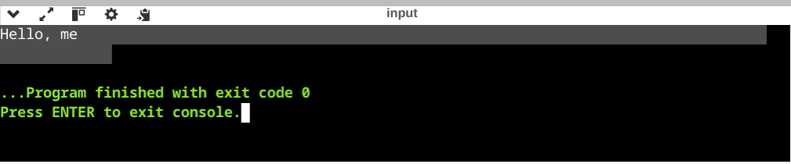
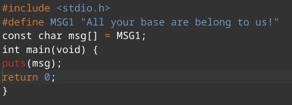

# 1.1 
(a) Functions. Create a block like structure to seprate functions from other programs variables and smaller functions 
(b) Accordingly: integer, string literal, char
(c) `double ans = 10.0 + 2.0/((3.0-2.0)*2.0)`

# 1.2
1. ans = 3.6
2. ans = 3.6
3. ans = 2
4. ans = 2 
CORRECTION: 
1. ans = 18.0/2+1*2+1
2. ans = 18.0/(2+1*2+1)
3. ans = 18.0/(2+1)*(2+1)
4. ans = 18.0/((2+1)*(2+1))

# 1.3 
`gcc -Wall main.c -o main.o`
`gdb main.o`

# 1.4

# 1.5
(a) No parentheses after `#include` statement. Correct `#include<studio.h>`
(b) Didn't assign value for arg1. Correct `arg1 = -1`
CORRECTION: change variable type to `int arg1` from `void arg1`
(c) Can't assign in preprocess expression. Correct `#define MESSAGE "Happy new year!"`